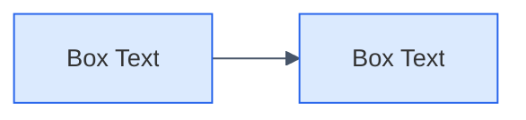

# BTRC QoS Platform - Diagram Style Guide
## Universal Styling Standards for All Diagram Types

---

## 1. Typography

| Element | Font Size | Weight | Notes |
|---------|-----------|--------|-------|
| Main Title | 24pt | Bold | Project/Diagram name |
| Subtitle | 18pt | Regular | Diagram type or description |
| Column/Section Headers | 14pt | Bold | Category labels |
| Box Titles (IDs) | 14pt | Bold | BP1, BO1, F1, etc. |
| Box Body Text | 13pt | Regular | Description text |
| Legend Labels | 12pt | Regular | Color key labels |
| Footer/Source | 10pt | Italic | Citations, references |

**Font Family**: **Inter** (primary - closest to anthropicSans), Roboto (alternative), Sans-serif (fallback)

> Note: anthropicSans is Anthropic's proprietary font and not publicly available. Inter provides a very similar modern aesthetic.

### Box Text Spacing

| Parameter | Value | Description |
|-----------|-------|-------------|
| TITLE_BODY_SPACING | 0.22 | Vertical gap between box title and body text |
| linespacing | 0.95 | Line height for body text |

---

## 2. Box/Shape Styling

| Property | Value |
|----------|-------|
| Shape | Rectangle (default, no rounded corners) |
| Border Width | 2px |
| Padding | Minimal (just enough for text readability) |
| Margin between boxes | Consistent spacing |

---

## 3. Color Palette

### Primary Element Colors

| Element Type | Fill Color | Border Color | Hex Codes |
|--------------|------------|--------------|-----------|
| Business Problem | Light Red | Red | `#fee2e2` / `#dc2626` |
| Business Objective | Light Blue | Blue | `#dbeafe` / `#2563eb` |
| Product Concept | Light Green | Green | `#d1fae5` / `#059669` |
| Feature | Light Yellow | Orange | `#fef3c7` / `#d97706` |
| Success Metric | Light Purple | Purple | `#f3e8ff` / `#7c3aed` |

### Secondary/Additional Colors

| Element Type | Fill Color | Border Color | Hex Codes |
|--------------|------------|--------------|-----------|
| Process/Flow | Light Cyan | Cyan | `#e0f2fe` / `#0284c7` |
| Data/Storage | Light Pink | Pink | `#fce7f3` / `#db2777` |
| System/Component | Pale Green | Dark Green | `#f0fdf4` / `#16a34a` |
| Neutral/Generic | Light Gray | Gray | `#f1f5f9` / `#64748b` |
| External/Cloud | Light Orange | Dark Orange | `#ffedd5` / `#ea580c` |
| Security | Light Indigo | Indigo | `#e0e7ff` / `#4f46e5` |
| User/Actor | Light Teal | Teal | `#ccfbf1` / `#0d9488` |

### Text Colors

| Usage | Color | Hex |
|-------|-------|-----|
| Title | Dark Navy | `#1e3a5f` |
| Subtitle | Blue | `#2563eb` |
| Body Text | Dark Gray | `#1f2937` |
| Footer | Medium Gray | `#6b7280` |
| Arrows | Slate | `#475569` |

---

## 4. Layout & Spacing

| Property | Value |
|----------|-------|
| Page Margins | Minimal (0.05" or equivalent) |
| Left/Right Margins | Reduced significantly |
| Box Spacing (horizontal) | Consistent, ~0.3-0.5 units |
| Box Spacing (vertical) | Consistent, ~0.2-0.4 units |
| Arrow Line Width | 2px |
| Dashed Line Width | 1px |

---

## 5. Format-Specific Guidelines

### 5.1 Python (Matplotlib)

```python
# Standard settings
import matplotlib.pyplot as plt
plt.rcParams['font.family'] = 'Inter'  # Closest to anthropicSans

FONT_SIZE = 14            # Headers, box titles
FONT_BODY = 13            # Box body text
FONT_TITLE = 24
FONT_SUBTITLE = 18
BOX_LINEWIDTH = 2
TITLE_BODY_SPACING = 0.22 # Reduced vertical gap between title and body
DPI = 150
PAD_INCHES = 0.02         # Minimal margins

# Use Rectangle (not FancyBboxPatch with rounding)
from matplotlib.patches import Rectangle

# Ensure no text overflow - adjust box height to fit content
```

### 5.2 Mermaid



### 5.3 PlantUML

```plantuml
@startuml
skinparam defaultFontSize 14
skinparam rectangleFontSize 14
skinparam rectangleBorderColor #2563eb
skinparam rectangleBackgroundColor #dbeafe
skinparam ArrowColor #475569
skinparam ArrowThickness 2
@enduml
```

### 5.4 ASCII/Text

```
Use simple box characters:
+------------------+
|   Box Title      |
|   Content text   |
+------------------+

Arrows: -->  <--  <-->
Connections: |  ---  ===
```

### 5.5 HTML/SVG

```css
/* Standard CSS variables */
:root {
  --font-size: 14px;
  --font-title: 24px;
  --font-subtitle: 18px;
  --border-width: 2px;
  
  --color-problem: #fee2e2;
  --color-problem-border: #dc2626;
  --color-objective: #dbeafe;
  --color-objective-border: #2563eb;
  --color-product: #d1fae5;
  --color-product-border: #059669;
  --color-feature: #fef3c7;
  --color-feature-border: #d97706;
  --color-metric: #f3e8ff;
  --color-metric-border: #7c3aed;
}

.box {
  font-size: var(--font-size);
  border: var(--border-width) solid;
  padding: 8px 12px;
}
```

---

## 6. Diagram Types & Their Color Mappings

### Business Objectives Model (BOM)
- Business Problems → Red
- Business Objectives → Blue
- Product Concept → Green
- Features → Yellow/Orange
- Success Metrics → Purple

### Data Flow Diagrams
- Data Sources → Pink
- Processing → Blue
- Storage → Green
- Output/Dashboard → Yellow

### Architecture Diagrams
- External Systems → Orange
- Internal Components → Blue
- Databases → Green
- APIs/Gateways → Purple
- Security → Indigo

### Process Flows
- Start/End → Gray
- Process Steps → Blue
- Decisions → Yellow
- Data → Green

---

## 7. Standard Footer

All diagrams should include:

```
Source: BTRC ToR (EOI: 14.32.0000.000.400.07.0021.25.1685) | [Diagram Type] (Reference if applicable)
```

---

## 8. Quick Reference

### Must Follow
- ✅ Font size 14pt for titles/headers, 13pt for body text
- ✅ Default rectangular boxes (no rounding)
- ✅ Minimal margins (especially left/right/top)
- ✅ TITLE_BODY_SPACING = 0.22 for box internal spacing
- ✅ Consistent color coding by element type
- ✅ 2px border width
- ✅ Include legend when multiple colors used
- ✅ Include source footer
- ✅ **No text overflow** - adjust box height to fit content

### Avoid
- ❌ Rounded corners on boxes
- ❌ Excessive padding/margins
- ❌ Font sizes smaller than 10pt
- ❌ Inconsistent colors for same element types
- ❌ Missing legends
- ❌ Cramped title-body spacing in boxes
- ❌ **Text overflowing outside box boundaries**

---

*Document: btrc-diagram-style-guide.md*
*Project: BTRC National QoS Monitoring Platform*
*Version: 1.0*
